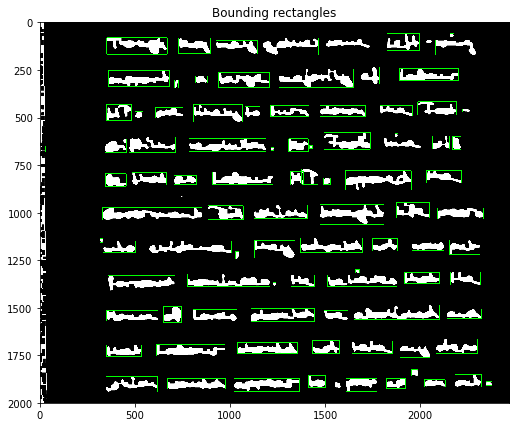

# Handwritten text recognition

	Welcome, to the Handwritten image recognition to convert that into a digitized words. 
The algorithm is built with the help of Neural Networks and IAM handwritten recognition dataset.

### Concepts and Dataset Used:
1. CNN
2. RNN(LSTM)
3. Clustering
4. Algebra
5. IAM handwritten dataset(Open source dataset)
6. CTC (Connectionist temporal Classifier)

### Python Libraries Used:
1. tensorflow
2. pandas
3. numpy
4. matplotlib.pyplot
5. sklearn.cluster
6. cv2
7. Self built libraries for word detection, char detection, document building.

### Working Procedural:

1.	The image is denoised as pre-cautionery measure(i.e. bad image consideration), the filters used for noised filteration are Gaussian filter and Median filter.

  

2.	Then, CNN's are used to detect the words based on gap between each word(the gap length is being detected by continous training and weights produced in the process).

3.	After the words are detected, the document provides a bag of objects(word images), which are scalar. Hence to vectorize each object, we are going with the process of clustering the bag of objects, to the number of clusters which equals the number of lines. Thereafter, the objects are sorted out in order by means of horizontal axis.

  

4.	After the word detection, each word is taken out as separate image and divided by means of characters and the process of character recognition starts identify each character, which excels through the process of training. CTC is the classifier used to classify the letter of different styles.

5.	Each word which got recognized is concatenated to make the whole document.

6.	Hola!!! the output is there to read.

  

